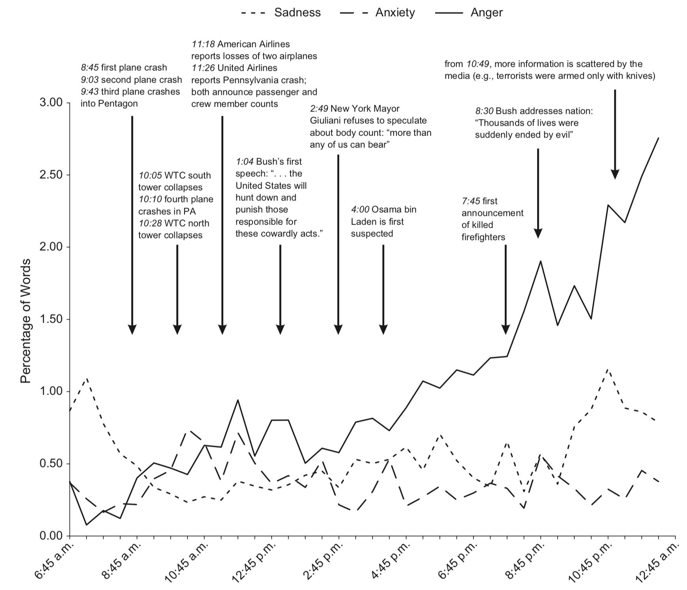
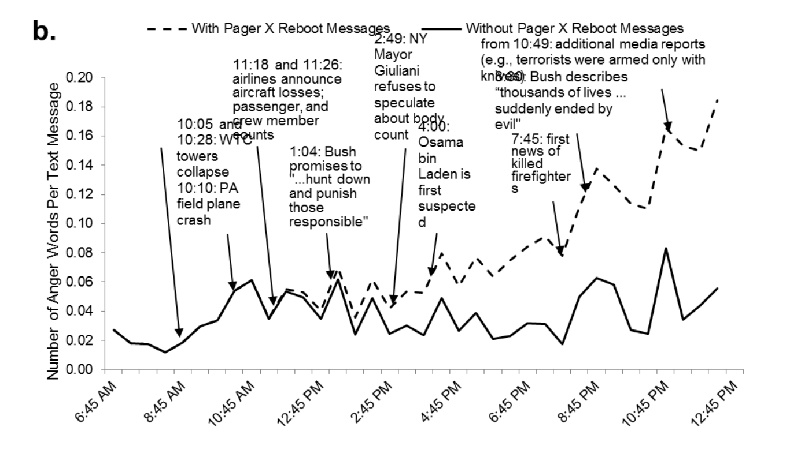
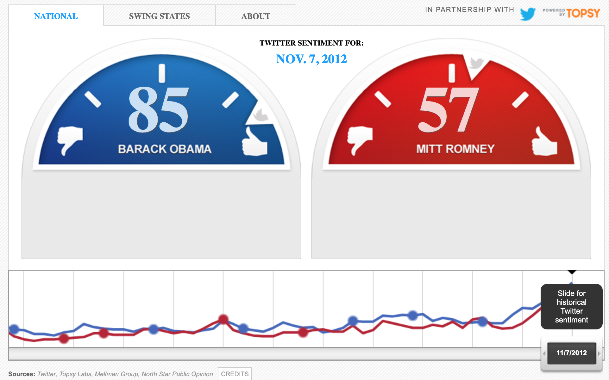
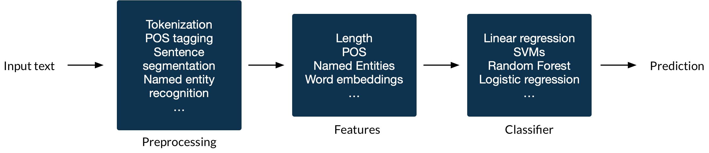
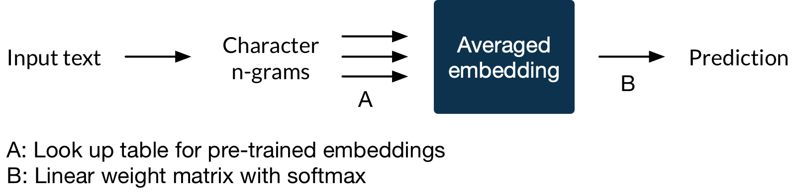
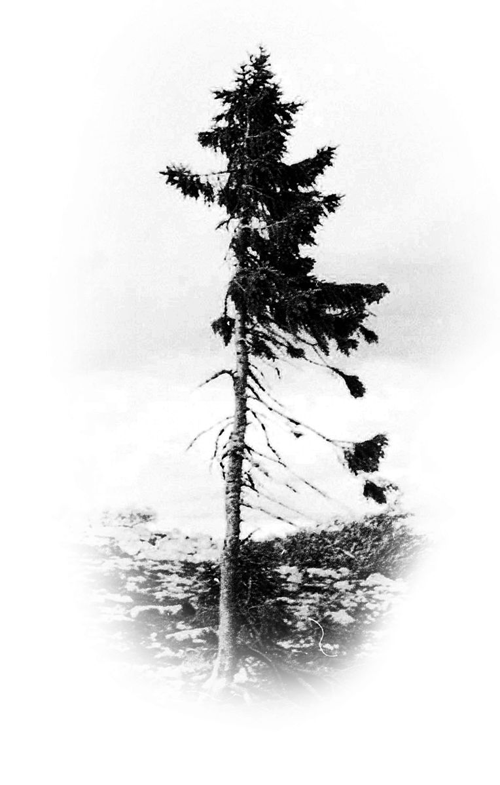
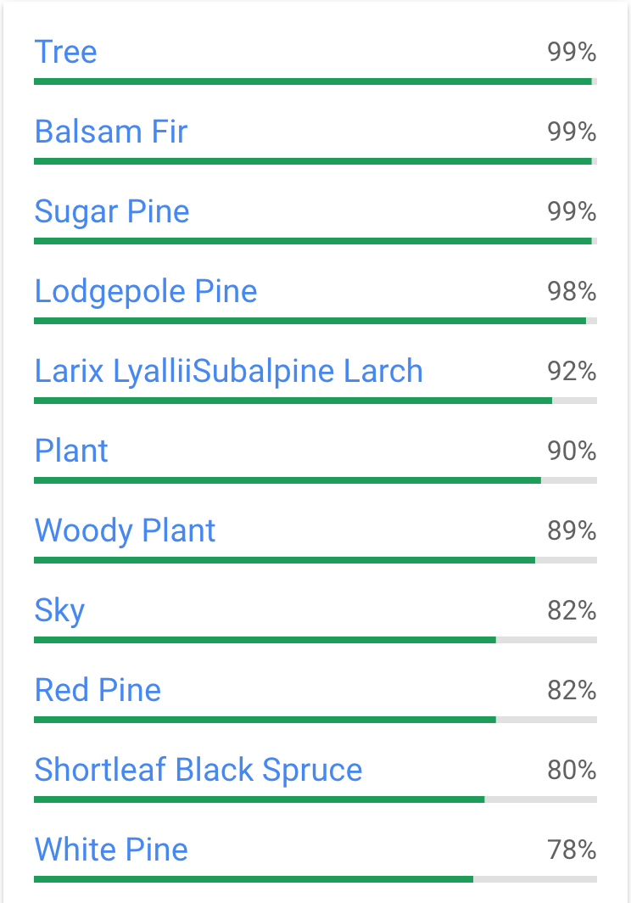
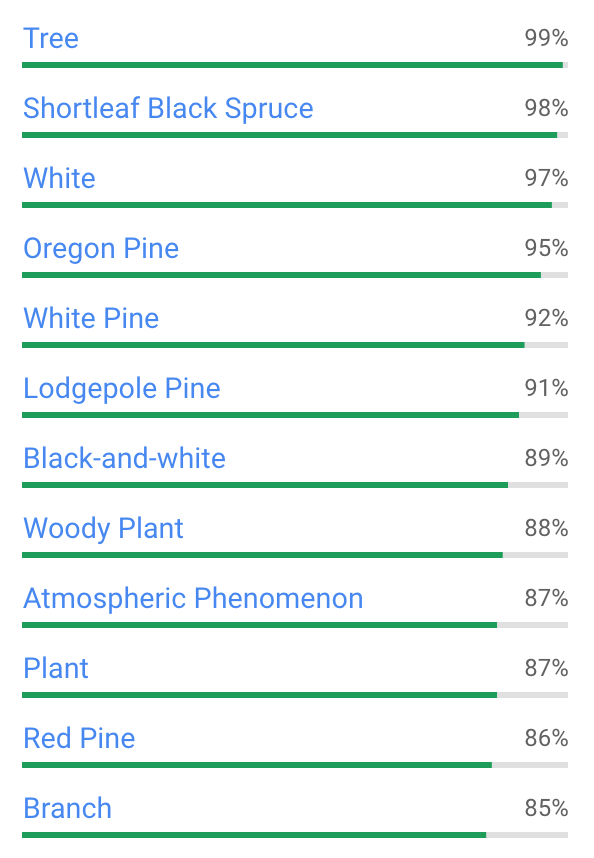

class: middle, center, dark-slide

# .hl[Common pitfalls in sentiment analysis]
## Martin Müller
R lunchs | June 4, 2019

---
class: light-slide
# Goals
- Intro sentiment analysis/text classification

--

- Focus on concepts rather than code

--

- Explore 3 common pitfalls, 2 methods for text classification

???
- You shouldn't have prior knowledge to be able to follow this, but maybe it would be good for me to know what the knowledeg distribution is
- I'm a Python user and you may ask yourself what the hell are you doing here- and no I'm not going into the whole R. vs. Python. Everything I'm going to talk about can be done in either language

---
class: light-slide

# Rule-based sentiment analysis
- Based on large dictionary of words and their sentiment, derived by experts
    ```
            mean  std
    unfair  -2.1  0.83066 [-1, -3, -3, -2, -3, -1, -2, -3, -1, -2]
    great    3.1  0.7     [ 2,  4,  4,  4,  3,  3,  3,  3,  2,  3]
    hate    -2.7  1.00499 [-4, -3, -4, -4, -2, -2, -2, -2, -1, -3]
    :'(     -2.2  0.74833 [-2, -1, -2, -2, -2, -2, -4, -3, -2, -2]

    ```
--
- Out-of-the-box method to compute sentiment (polarity), subjectivity, emotions (anger, happiness, etc.)
    ```r
    if (!require("pacman")) install.packages("pacman")
    pacman::p_load(sentimentr, dplyr, magrittr)
    mytext <- c('do you like it?  But I hate really bad dogs',
    'I am the best friend.',
    'Do you really like it?  I\'m not a fan')
    mytext <- get_sentences(mytext)
    sentiment_by(mytext)
    ##    element_id word_count       sd ave_sentiment
    ## 1:          1         10 1.497465    -0.8088680
    ## 2:          2          5       NA     0.5813777
    ## 3:          3          9 0.284605     0.2196345
    ```

---
class: light-slide
# `SentimentR` package

- Averages the polarity of words in a local cluster
- Amplifiers increase polarity by 1.8 (e.g. .hl[very] good)
- De-amplifiers reduce polarity (e.g. slightly, decently, etc.)
- Negation is factored in as `\((-1)^{n}\)`, with `\(n\)` as the number of negators
- Adversative conjunctions (e.g. but, however, although) increase polarity of the following cluster and decreases polarity of the previous cluster

--

### &rarr; In practice works relatively well

---
class: light-slide
# An emotional timeline of the 9/11 attacks

- 573,000 pager messages (published by Wikileaks, 2009), 6.4M words

.center[]

.footnote[Back, Mitja D., et al., SAGE Psychological Science, 2010]
---
class: light-slide

.mb-5[Of the 16,624 instances of anger words, 5,974 (35.9%) was the word .hl[critical]]

--

.mb-5[
```
Reboot NT machine [name] in cabinet [name] at [location]:CRITICAL:[date and time].
```
]
--

.center[]


.footnote[Pury, SAGE Psychological Science, 2011]

---
class: dark-slide, middle, center

#.hl[Pitfall #1] Never skip quality control

---
class: light-slide, middle, center

# .hl[Hypothesis]: What we usually want is stance and not sentiment

---
class: light-slide, middle, center



USA today's Twitter Election meter

---

class: light-slide

# What is stance?

.footnote[From the SemEval 2016 stance dataset]

| Example   |      Target      | Stance |  Sentiment |
|:----------|:-----------------|:-------|:-----------|
|`If abortion is not wrong, then nothing is wrong. Powerful words from Blessed Mother Teresa.`| Abortion | .red[Against] | .green[0.49] |

--
|`8 years ago today my son was taken from me. If there's a god, fuck you, fuck you very much.`| Atheism | .green[Favor] | .red[-0.48] |

--
|`Hillary Clinton has some strengths and some weaknesses.`| Hillary Clinton | Neutral | .red[-0.35] |

--
|`Benghazi must be answered for #Jeb16`| Hillary Clinton | .red[Against] | 0 |

---
class: dark-slide, middle, center

# .hl[Pitfall #2] Opinion (=stance) is often not the same as sentiment (=tonality)

---
class: light-slide
# In search for a better method

Given that we have some annotated data, we can design our own algorithm


.mb-5.center[]

--

.hl[Problem]: We are lazy :)

---
class: light-slide
# In search for a better method: FastText

.footnote[A. Joulin et. al, Bag of Tricks for Efficient Text Classification (2017)]

- Requires little to no preprocessing
- Very suitable for text with slang or lots of spelling mistakes
- As the name suggests: It trains very fast (<10s for >10k samples)
- No GPU required
- Pretrained for 157 languages
- Model sizes of around 100MB (compressable to around 100kB at similar performance using `FastText.zip`)

---
class: light-slide
# In search for a better method: FastText

- Each word is split into character n-grams. Example for n=3:
    ```
    where = ['<wh', 'whe', 'her', 'ere', 're>', '<where>']
    ```
.mb-5[]

- Large improvements for languages like German, Turkish and Arabic

---
class: light-slide, middle, center

# The problem with language

---
class: light-slide, center, middle


.pd-left[]


Oldest tree in the world (9,500 years old, Sweden)

.footnote[Source: Wikimedia]
---
class: light-slide, center, top


.pd-left[]


.pd-left[]

.footnote[Source: Google Compute Vision API]
---
class: light-slide, center, top

# What about historic text

.small.center.hl[Now]
.small[Can you write a sentence in English the way it would look now, one hundred years ago, and five hundred years ago?]

.small.center.hl[400 years ago]
.small[Canst thou write a sentence in English, in the wise that it looketh now, and look’d an hundred years past, and yet five hundred years past?]

.small.center.hl[500 years ago]
.small[Canst thou writ a sentence yn Englissh, yn such wise as yt seemeth nou, and seemed an hundred yeeres gonne, and fiue hundred yeeres gonne?]

.small.center.hl[600 years ago]
.small[Canst thou wryt ane sentence yn Englische yn this wise: that as yt semeth nouwe, and hath semed an hundred yeres ygonne, and fiue hundred yeres ygonne?]

.small.center.hl[1000 years ago]
.small[Meaht þu writan anne cwide in Ænglisc þus, swa he nu biþ, ond swa he hundred geara ær wæs, ond swa fif hundred geara ær?]

---
class: light-slide
# ... but not only that

- The meaning of words can change
- Constantly new words are introduced in slang
- New public figures appear

... and worst of all:
- Our model of the world and implicit shared knowledge changes constantly

--
### Text classifiers of >5 years ago are likely to be outdated now! (aka. model drift)


---
class: dark-slide, center, middle
#.hl[Pitfall #3] Share models & annotation data and make your work reproducible

---
class: dark-slide, center, middle
#.hl[Thank you]

---
class: light-slide, center, middle

One book I specifically recommend on the topic:

[Bit by bit: Social Research in the Digital Age](https://www.bitbybitbook.com/)

(free to read online)
